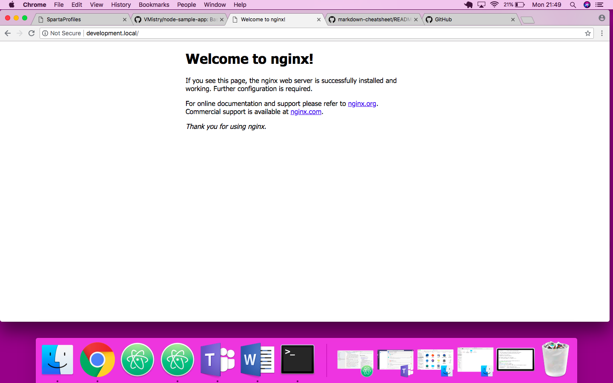

# Sparta Node Sample App
#Viren
## Description

This app is intended for use with the Sparta Global Devops Stream as a sample app. You can clone the repo and use it as is but no changes will be accepted on this branch.

To use the repo within your course you should fork it.

The app is a node app with three pages.

### Homepage

``localhost:3000``

Displays a simple homepage displaying a Sparta logo and message. This page should return a 200 response.

### Blog

``localhost:3000/posts``

This page displays a logo and 100 randomly generated blog posts. The posts are generated during the seeding step.

This page and the seeding is only accessible when a database is available and the DB_HOST environment variable has been set with it's location.

### A fibonacci number generator

``localhost:3000/fibonacci/{index}``

This page has be implemented poorly on purpose to produce a slow running function. This can be used for performance testing and crash recovery testing.

The higher the fibonacci number requested the longer the request will take. A very large number can crash or block the process.


### Hackable code

``localhost:3000/hack/{code}``

There is a commented route that opens a serious security vulnerability. This should only be enabled when looking at user security and then disabled immediately afterwards

## Usage

Clone the app

```
npm install
npm start
```

You can then access the app on port 3000 at one of the urls given above.

## Tests

There is a basic test framework available that uses the Mocha/Chai framework

```
npm test
```

The test for posts will fail ( as expected ) if the database has not been correctly setup.

## Vagrant - What to do...
To use Vagrant within this document you should..
 1. Download and install both Vagrant using this link https://www.vagrantup.com/.
 2. Download and install Virtual box using this link https://www.virtualbox.org/wiki/Downloads.
    1. Download the app.
    2. Try to install it.
    3. If it fails to download click the apple
    4. Then select system preferences/security and privacy
    5. When in security and privacy, accept the software. This will allow you to successfully install the software.
 3. In your terminal, navigate to the "node-sample-app.git" folder. This should contain the Vagrant files inside.
 4. Then you should type in "vagrant init", to create a vagrant folder in side the file.
 5. Type in "atom ." inside the terminal, this will open up the atom software, to edit the vagrant file inside.
 6. Once the app is open, go in to the vagrant file, delete the contents inside and type in the following...
 ```ruby
 Vagrant.configure("2") do |config|
   config.vm.box = "ubuntu/xenial64"
   config.vm.network("private_network", ip: "192.168.10.100")
   config.hostsupdater.aliases = ["development.local"]
 end
 ```
 7. Save the code and close atom.
 8. In the terminal, type in "vagrant up". This command will creates and configures guest machines according to its Vagrantfile.
 9. Once it has configured, type in "vagrant ssh". This will open up ubuntu on to your device.
 10. Inside the ubuntu shell, type in "sudo apt-get update -y". This will allow you to check and install any updates which is needed.
 11. Once the update has been installed, type in "sudo apt-get install nginx -y". This will install the web-server nginx.
 12. After installing nginx, type "exit", to exit the shell.
 13. When out of the shell, type in "vagrant plugin install vagrant-hostsupdater". This will give the server an ip address, so that you can access the server.
 14. Once finished installing the plugin, type in "vagrant reload". This is usually required for changes made in the Vagrantfile to take effect, modifying the server.
 15. To test it out, open up a web browser.
 16. In the URL type in "http://development.local/". This will run your server. Below should happen.
 
